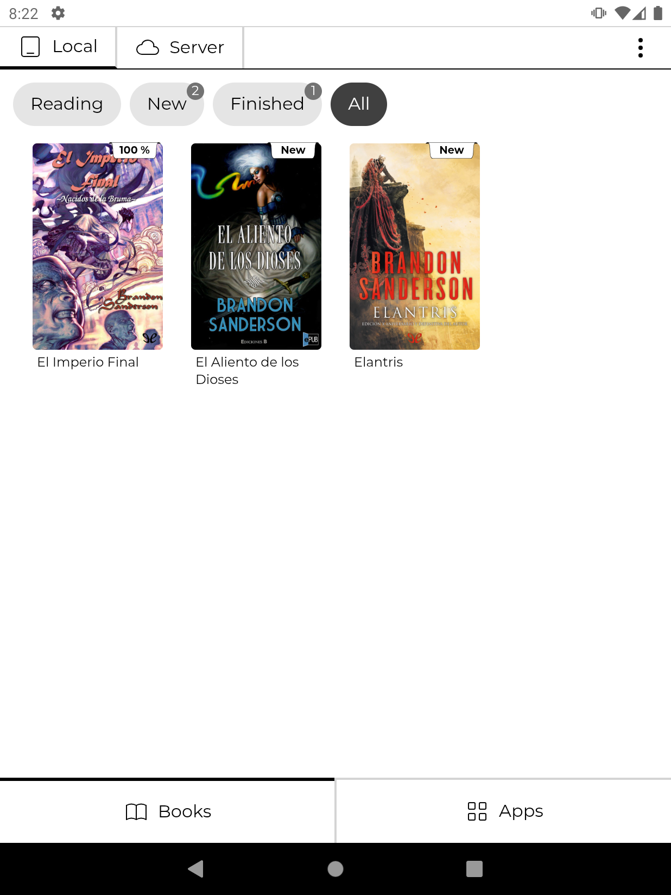
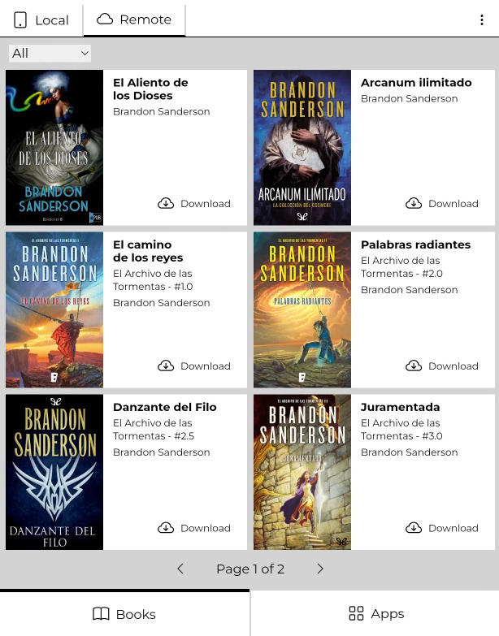
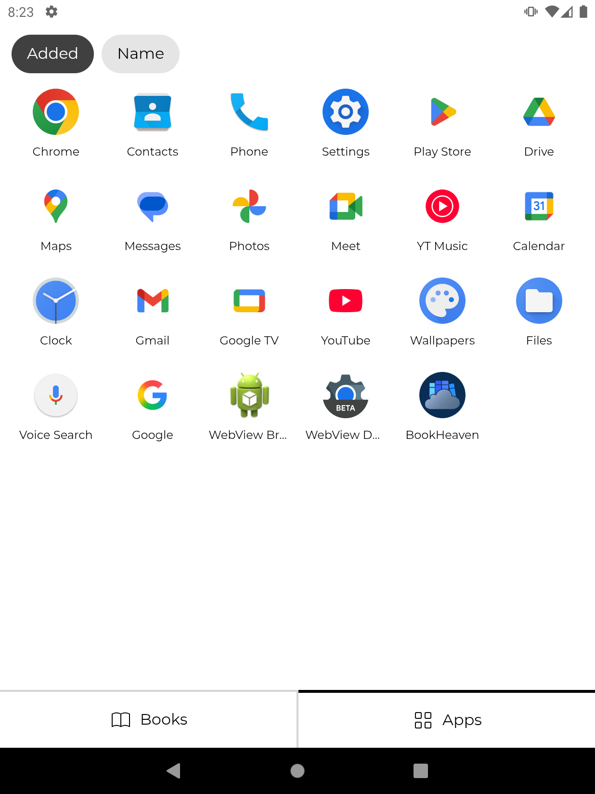
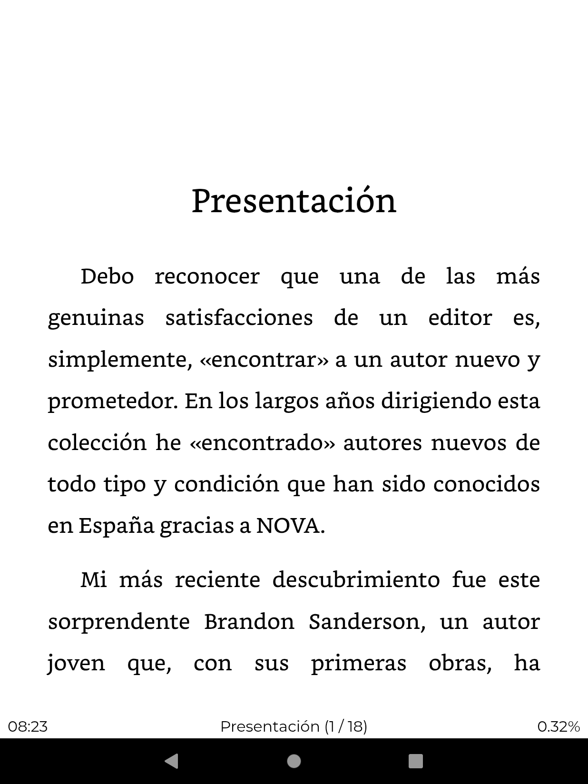
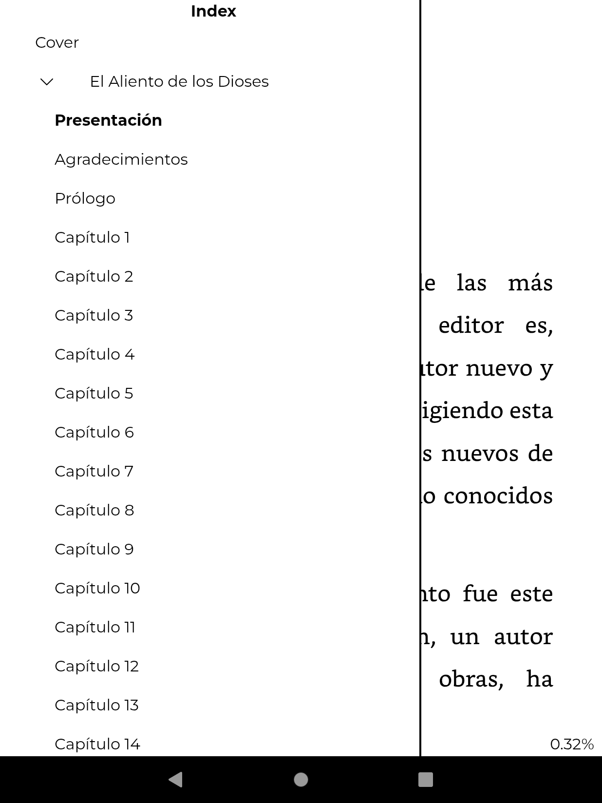
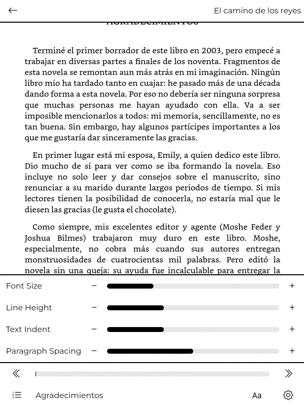
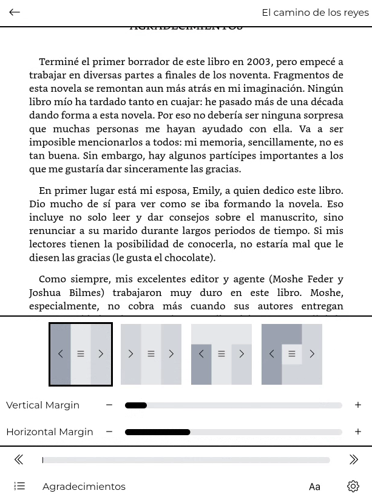

  

<h1 align="center">BookHeaven Reader</h1>

BookHeaven Reader is part of the BookHeaven "ecosystem", which aims to provide a very convenient way to manage and read your ebook library. 
It connects to the Server to download whatever books you want to read, it also can be set as the home launcher since it includes a basic app drawer for extra convenience.

---

## :warning: Disclaimer
- This app is only for Android devices and optimized for e-ink displays
- You might need to update the WebView implementation of your device (pretty easy, more on the troubleshooting section below)
- It won't work as standalone (it needs to connect to a Server instance to get the books)
- Portrait mode only, at least for now
- No dictionary, no notes

> [!NOTE]
> If you haven't setup the Server yet, [check out the repository](https://github.com/BookHeaven/BookHeaven.Server) to get started.

## :sparkles: So, what are the main features?
- Can be set as launcher, with access to a basic but functional app drawer.
- Easily connect to your Server to download books
- Date (start and end), elapsed reading time tracking
- Sync progress to the Server
- Very customizable (font size, line height, page margins, paragraph spacing, indent, etc)
- Allows to choose from a few navigation layouts variations
- Page navigation should work with physical buttons as well (Only tested with Meebook M7)

## :globe_with_meridians: Supported UI Languages
- English
- Spanish

## :hammer_and_wrench: Troubleshooting
### The UI looks weird, what's going on?
The app is web based and it uses technologies that might bee too modern for the included WebView implementation of your Android device.
Luckily, it's very likely that you'll be able to replace it with an updated one from the Play Store.
Steps might vary for your device, but overall this is what you need to do:
1. Go to the Play Store, search for "Android System Webview" and install it
  > [!NOTE]
  > Many versions will be listed. Ideally you want the one that's just called "Android System Webview", but for me only "Dev", "Canary" and "Beta" show up. 
  > I use the Beta version personally and it works just fine.  
  > If you want the actual stable release, which might not show up, you can go to the Play Store from your pc and install it to your device from there. 
  > Here's the link: [https://play.google.com/store/apps/details?id=com.google.android.webview](https://play.google.com/store/apps/details?id=com.google.android.webview) 

2. Enable the developer settings if you haven't already
3. Look for WebView Implementation, and change it to the one you just downloaded
  > [!NOTE]
  > If it doesn't show up, or doesn't allow you to change it, try restarting, or try going to Apps > Show System apps and disable the included WebView, then restart and check again.
4. Restart your device to apply the change
5. Profit

## :framed_picture: Screenshots

The screenshots have been taken from a computer screen. Obviously, don't expect to see colors on your e-ink device, unless it's super fancy.

<table>
  <tr>
    <td>
      
    </td>
    <td>
      
    </td>
    <td>
      
    </td>
  </tr>
  <tr>
    <td>
      
    </td>
    <td>
      
    </td>
    <td>
      
    </td>
  </tr>
  <tr>
    <td>
      
    </td>
    <td>
      
    </td>
    <td></td>
  </tr>
</table>

## :package: Credits
- Blazor.ContextMenu (https://github.com/stavroskasidis/BlazorContextMenu)
- BlazorPanzoom (https://github.com/shaigem/BlazorPanzoom)
